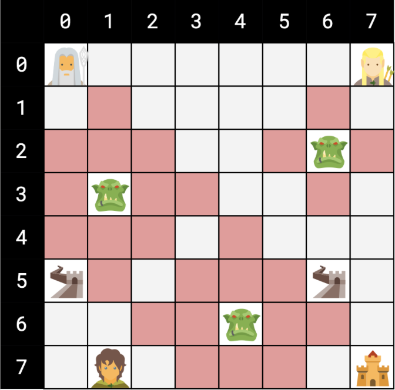
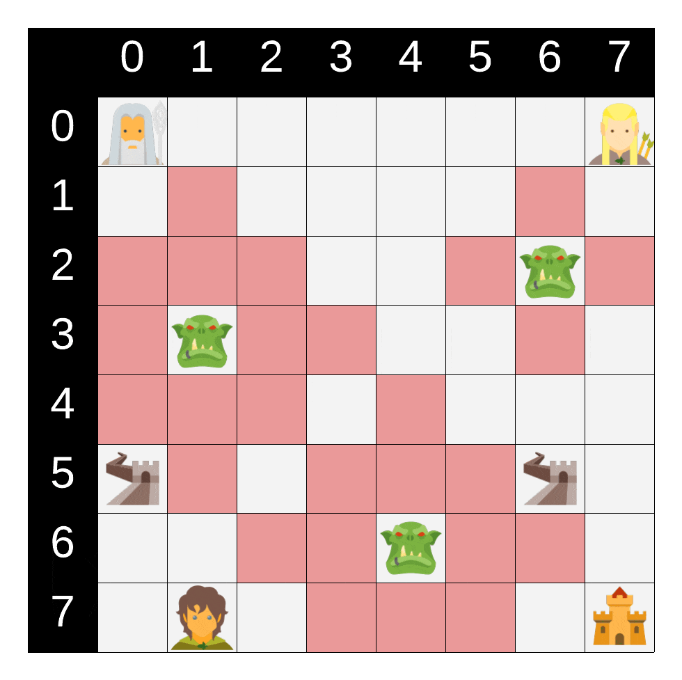

# Gandalf the Grey and The Fellowship of the Ring's Quest

Gandalf the Gray is tasked to lead and guide the Fellowship of the Ring against the dark lord Sauron. For this, he has to pass the ring companions through the orcs, who are Sauron's army, and take each of them to a specific place, and at the end, he goes to Gondor. Gandalf has a map that looks like a chessboard that includes the following:

- Gandalf's starting point
- Location of each of the companions of the ring
- Location of the orcs
- The place where each of the companions of the ring should be placed
- Final Position (Gandor)

Each orc has a military rank n, according to which they guard houses with a Manhattans distance of n that Gandalf and the Fellowship of the Ring cannot pass. Because Gandalf is supposed to pass through the orcs at night when they are asleep, he can pass through the houses they are guarding as long as he doesn't wake them up. After passing n houses in the area under the supervision of orcs, they will wake up (that is, with the n+1th move, you should go outside the site). After leaving the area under the supervision of orcs, it is possible to return to that area regardless of previous movements. In each action, Gandalf can move to one of the four houses adjacent to the current house (up, down, left, and right), considering that the destination house is not outside the map and there are no orcs in it. Passing by the place where each member of the Fellowship of the Ring is located, Gandalf picks him up, and after reaching where he should be, he settles him there without wasting time. Gandalf can only carry one member of the Fellowship at a time. The position of each member and where they should be placed is never within the scope of orcs' supervision, and the two areas under orcs' control are not shared.

## Input format

Basic information will be provided to you in a file in the following format:
The first line provides n and m, respectively, where n is the number of rows on the map and m is the number of its columns.
The following two lines show the coordinates of the start and end points, respectively. (first, the row number from the top, then the column number from the left)
The following line shows k and l, where k represents the number of orcs and l represents the number of fellowship members.
In the following k lines, x, y, and c are stated, where x is the row number, y is the column number, and c is the orc's military-grade or Manhattan distance under the supervision of an orc.
In the following l lines, the current location of each member is listed in order.
In the following l lines, the place where the ring member should be placed is given. Note that each member must be put in a specific location.

For example, consider the following entry:

```
8 8
0 0
7 7
3 2
3 1 2
2 6 1
6 4 2
0 7
7 1
5 0
5 6
```

So the table looks like this:



Member in the house (0,7) should be moved to the house (5,0) and member in the house (7,1) to the house (5,6). Gandalf first goes to the house (0,7) and moves the member to the house (5,0). Then he goes to the house (7,1) and transfers that member to the house (5,6). Finally, it goes to the house (7,7), the final place. Note that when we enter the range of an orc, the n steps that we can be in its range are reduced. That is, if we are in the house (4,5) and we enter the house (4,4), which is in the range of an orc, considering that the n of that orc is equal to 2, we can be in the range of that orc in just one more move. (that is, only one more move can be made if that house's destination is under that orc's supervision). Also, if we leave the range of an orc, the previous moves are ignored. If we enter again, we can stay in its range for two actions. With these assumptions, the path of Gandalf's movement is as follows:

```
(R: Right, L: Left, U: Up, D: Down)

RRRRRRRDDDDLLLLDLLLDDRUURURRRDRDDR
```



## How to use

### Running Breadth-First Search (BFS)

To search with BFS algorithm run:

```shell
python3 src/bfs.py tests/test_[TEST_NUMBER].txt
```

### Running Iterative Deepening Depth-First Search (IDS)

To search with IDS algorithm run:

```shell
python3 src/ids.py tests/test_[TEST_NUMBER].txt
```

### Running A* Search

To search with A* algorithm run:

```shell
python3 src/a_star.py tests/test_[TEST_NUMBER].txt
```
